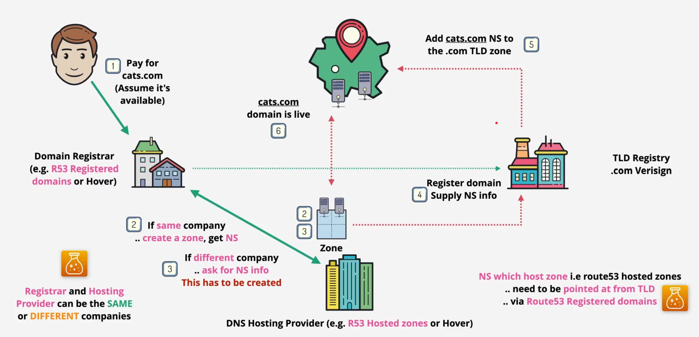
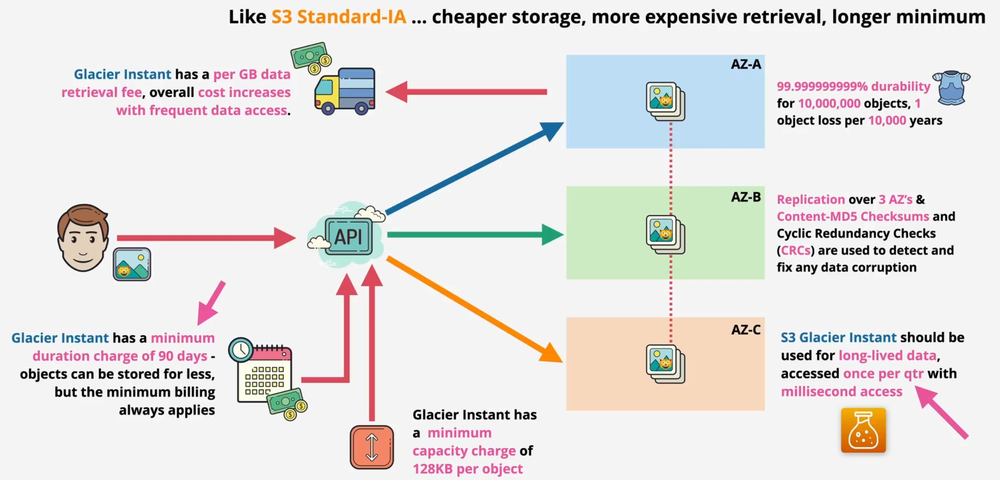

# AWS journey

## Cloud fundamental

### Cloud computing

What: a model for enabling ubiquitous, convenient, on-demand network access to a shared pool of configurable computing resources (network, server, storage, application, and service) that can be rapidly provisioned and released with minimal management effort or service provider interaction. This composed of 5 essential characteristics, 3 service models, 4 deployment models.

- Characteristics:
  - On-demand self service: consumer can unilaterally provision computing capabilities as `needed automatically without requiring human interaction` with each service provider.
  - Broad network access: capabilities are available over the network and accessed through standard mechanisms.
  - Resource pooling: there is a sense of location independence ... no control or knowledge over the exact location of the resources. Resources are pooled to serve multiple consumer using a multi-tenant model
  - Rapid elasticity: capabilities can be elastically provisioned and released to scale rapidly outward and inward with demand.
  - Measure service: resource usage can be monitor, controlled, report and billed
- Cloud service models (x as a service): depend on infrastructure stack:
  

- Shared Responsibility Model
  

## HA vs FT vs DR

High-availability: minimize any outages, aims to ensure an agreed level of operational performance, usually uptime, for a higher than normal period. Maximum online system time. (ready tires for replace)

Fault-tolerance: operate through faults, the property that enable a system to continue operating properly in the event of the failure of some (one or more faults within) of its component (plane has 2 turbo for each part)

Disaster recovery: a set of policies, tools and procedures to enable the recovery of continuation of vital technology infrastructure and system following a natural or human-induced diaster

## YAML ain't markup language

YAML: human readable data serialization language

A YAML document is an unordered collection of key:value pair, each key has a value

## Javascript Object Notation (JSON)

JSON is a lightweight data-interchange format. It's easy for humans to read and write. It's easy for machines to parse and generate.

## Encryption

## Networking starter pack

- Local networking - ethernet
- Routing
- Segmenting, Ports & sessions
- Application
- OSI 7 - Layer Model: Physical - data link - network (<- media layer, host layer ->) - transport - session - presentation - application

### Layer 1: Physical

Physical medium can be copper (electrical), fibre (light) or wifi (RF)

Layer 1 specification define the transmission and reception of RAW BIT STREAMS between a device and SHARED physical medium. It defines things like voltage levels, timing, rates, distances, modulation and connectors

HUB: any thing received on any port, is transmitted on every other port. No device addressing, all data is processed by all devices.

### Layer 2: Data link

Device at L2 have unique hardware (MAC) address. 48 bit, in hex, 24 bits for manufacturer. Frame can be addressed to a destination or broadcast.

Frame

CSMA/CD (Carrier Sense Multiple Access with Collision Detection):

Switch: understand frames and MAC address. They maintain a MAC address table which starts off empty. As the switch receives frames on its ports, it learn which devices are connected and populates the MAC address table.

Ethernet is a L2 protocol used generally for local networks. Long distance point to point links will use other more suitable protocols such ass PPP/MPLS/ATM

LAN1 and LAN2 are isolated local area networks. Using only layer 2, only those networks joined by a direct point to point link using the SAME layer 2 procotol could communicate.

### Layer 3: Network

Internet protocol (IP) is a Layer3 protocol which adds cross network IP addressing and routing to move data between Local Area Networks without direct P2P link.

IP packets are moved step by step from source to destination via intermediate network. Encapsulated in different frames along the way.

Routers (L3) devices, remove frame encapsulation and add new frame encapsulation at every hop.

Packet

IP address v4

- Dotted-decimal notation
- 2 part: network and host
- Subnet mask: which allows a host to determine if an IP address it needs to communicate with is local or remote - which influences if it needs to use a gate way or can communicate locally

Address resolution protocol (ARP): in side local network

Problem:

- Provides no ordering mechanism
- not guaranteed to be reliable
- pakcet can be lost
- no flow control

### Layer 4 - Transport

TCP (slower / reliable) vs UDP (fast / less reliable)

TCP is a connection based protocol. A connection is established between two devices using a random port on a client and a known port on the server. Once established the connection is bi-directional. The "connection" is a reliable connection, provided via the segments encapsulated in IP packet.

Network address translation (NAT): designed to overcome IPv4 shortages, also provides some security benefits, translate private IPv4 address to public.

- Static NAT 1 private to 1 (fixed) public address (IGW)
- Dynamic NAT : 1 private to 1st available public
- Port address translation (PAT): many private to 1 public (NATGW)

## DDoS

## SSL and TLS

Privacy and data integrity between client & server.

## Hashing

Hash function: 1 way, same document -> same hash

## Digital signatures

Private: you know - decrypted
Public: anyone know - verified

## DNS

What: convert DNS name to IP address

Why:

Term

- DNS zone ... a database e.g. \*netflix.com containing records
- ZoneFile .. the file storing the zone on disk
- NS (name server)... a DNS server which hosts 1 or more Zones ... and stores 1 or more ZoneFiles
- Authoritative ... contains real/genuine records (boss)
- Non-authoritative/cached ... copies of records/zones stored elsewhere to sped things up

Register a domain

DNS record types

- Nameserver (NS):
  
- A and AAAA records: host to IP
- CNAME record: host to host
- MS records:
- TXT records

## DNSSEC

Benefits:

- Data origin authentication : this data comes from this zone
- Data integrity protection: this data hasn't been modified in transit
- DNS chain of trust: root zone -> records

## Recovery Point Objective (RPO) & Recovery Time Objective (RTO)

## Public vs Private vs Hybrid vs multi cloud

## Virtualization 

## AWS certifications

## AWS accounts

### MFA

Factor - pieces of evidence which prove identity

4 type of evident:

- Knowledge: something you know: username, password
- Possession: something you have: bank card, MRA device/app
- Inherent: something you are: fingerprint, face, voice or iris
- LocationL a location (physical), which network (corp or wifi)

More factors means more security & harder to fake

### Step setup new account

## Overview

History

- 2002: internal launched

AWS global infrastructure

- Region: a cluster of data center
  - Geographic separation: Isolated fault domain
  - Geopolitical Separation: different governance
  - Location control: performance
- Availability zones: each region have many availability zone (usually 3, min is 2, max is 3)
  
- Data center: each zon is one or more discrete data centers with redundant power, networking, and connectivity
- Edge location/point of presence:

Service resilience

- Globally Resilient
- Region Resilient
- AZ Resilient

How to choose an region:

- Compliance: data never leaves a region without your explicit permission
- Proximity to customers: reduced latency
- Available services within a region
- Pricing:

## Public vs Private Services

Public or Private service refer to networking perspective: public internet zone vs VPC (AWS private zone vs AWS public zone)

On-premises can access VPCs only if configured via VPN or Direct Connect

## Virtual Private Cloud (VPC)

- A VPC = A Virtual Network inside AWS
- A VPC is within 1 account & 1 region
- By default, private and isolated unless you decide otherwise
- 2 types: Default VPC and Custom VPCs

Default VPC

- One per region - can be removed & recreated
- Default VPC CIDR is always 172.31.0.0/16
- /20 subnet in each AZ in the region
- Provide default internet gateway (IGW), security group (SG) & NACL
- Subnets assign public IPv4 addresses

## Identity and Access Management (IAM) basic

What:

- securely manage identities and access to AWS service and resources
- a centralized hub of control within AWS and integrates with all other AWS Services.

Why:

- manage and scale workload and workforce access securely supporting your agility and innovations.
- control who is authenticated (signed in) and authorized (has permissions) to use resources.

How: you can specify `who or what` `can access` `services` and resources in AWS, centrally manage fire-grained permission, and analyze to refine permission across AWS

3 types of entities object

- User: identities which present `humans` or `applications` that need access to your account
- Group: collection of related user e.g. dev, hr, ...
- Role:can be used by `AWS services` or for granting `external access` to your account

Role is general used when you want to grant access to services in your account to uncertain number of entity (ex: all ec2 access to s3). Pick IAM user when you identify the individual thing you login to that user

Policy document: allow or deny access to AWS services. In order for user, group, or role to properly set permission, they use policies. They attached to IAM entities so that the IAM entity in question can perform its necessary function

- Consist of: version, id (optional), statement (required).
- Statement consists of: Sid (optional), effect (allow, or Deny), principal (account/user/role to which this policy applied to), action (list of action this policies allow or deny), resource (list of resources to which the actions applied to), condition (optional)

IAM has 3 main jobs:

- Manage identities: an ID provider (IDP): create, modify and delete identity
- Authenticate: prove you are who you claim to be
- Authorize: allow or deny access to resources

Key details

- No cost
- Global service/Global resilience
- Allow or deny its identities on its AWS account
- No direct control on external account or user
- identity federation (GG, FA, ...) and MFA
- Root account created by default, should/be be used or shared
- Group only contain users, not other group
- User don't have to belong to a group, and user can be long to multiple group
- In AWS you apply the `least privilege principle`

### IAM access key

Note: as a best practice, use temporary security credential (such as IAM role) instead of creating long-term credentials like access keys.

Long-term credentials for an IAM user or the AWS account root user.

It consists of two pars: an access key id and a secret access key.

You can have a maximum of two access keys per user.

Access key can be create, delete, active or deactivate.

## Identity Policies

Explicit Deny alway win explicit Allow

### IAM User

Definition: an identity used for anything requiring long-term ASW access e.g. (single) Humans, Applications (backup app), or service account.

- 5000 IAM users per account
- IAM user can be a member of 10 groups
- This has systems design impacts...
- Internet-scale application, limit for large orgs & org merges
- > 5000 IAM users, we can use IAM Role & Identify Federation

### IAM Group

Definition: container for users

- No nesting
- 300 groups per account
- Groups are not a true identity. They can't be referenced as a principal in a policy

### IAM Roles

Definition:

Use case: If you can identify the number of principal which use the identify, then it can be candidate for IAM role.

When to use IAM Roles:

Service-linked roles

- IAM role linked to a specific AWS service
- Predefined by a service
- providing permission that a service needs to interact with other AWS service on your behalf
- SErvice might create/delete the role
- or allow you or deny the setup or within IAM
- You can't delete the role until it's no longer required

### Organization Account

Definition:

Use case:

Service Control Policy:

- Feature for AWS organization
- account permission boundaries
- they limit what the account (including account root user) can do
- they don't grant any permission

### Amazon Resource Name (ARN)

Definition: uniquely identify resources within any AWS account.
Format:

- arn:partition:service:region:account-id:resource-id
- arn:partition:service:region:account-id:resource-type/resource-id
- arn:partition:service:region:account-id:resource-type: resource-id

## AWS Fundamentals

### Elastic Compute Cloud (EC2)

- IAAS - Provide virtual machine - instances
- Private service by default - uses VPC networking
- AZ resilient - instance fails if AZ fails
- Different instance sizes and capabilities
- On-demand billing - per seconds
- Local on-host storage or Elastic Block Store (EBS)

Instance lifecycle

### Amazon Machine Image

### Simple Storage service (S3)

- Global Storage Platform - regional based/resilient
- Public service, unlimited data & multi-user
- economical & accessed via UI/CLI/API/HTTP
- Unlimited objects in bucket, 0 bytes to 5TB
- Key = name, value = data
- Objects & Buckets
  
  

- Bucket name

  - Global unique
  - 3-63 characters, all lower case, no underscore
  - start with a lowercase letter or number
  - can't be IP formatted
  - buckets - 100 soft limit, 1000 hard per accounts

- S3 pattern and anti-pattern
  - s3 is an object store - not file or block
  - you CAN'T MOUNT an s3 bucket as K:\ or /image
  - great for large scale data storage, distribution or upload
  - great for offload
  - input and/or output to many aws product

### CloudFormation

YAML or JSON

Template

- Resources: mandatory
- Description must directly follow AWSTemplateFormatVersion
- Metadata: control UI
- Parameters:
- Mapping: use for lookup
- Conditions:
- Outputs:

### CloudWatch

Public service - usable from AWS or on-premises

Store, monitor and access logging data

Can generate metrics based on logs - metric filter

- Collects and manage operational data
- Metrics: AWS products, Apps, on-premises
- CloudWatch Logs: AWS products, Apps, on-premises
- CloudWatch events - AWS services & schedules

Concept:

- Namespace:
- Metric
- Dimension

### Route53

1. Register domain
2. Host Zones ... managed nameservers

- Hosted on 4 managed name servers
- Can be public
- or private linked to VPC(s)

- Global service ... single database
- Globally Resilient

## CloudTrail

- Regional service
- Logs API calls/activities as a CloudTrail Event
- 90 days stored by default in Event History ..
- Enabled by default - no cost for 90 history
- To customize the service ... create 1 or more TRails
- Trails are how you configure S3 and CWLogs
- Management event and Data Event
- Management event only by default
- IAM, STS, CloudFront => Global Service Events
- Not realtime - there is a delay

## AWS Control Tower

- Quick and easy set up of multi-account environment
- Orchestrates other AWS servece to prove this functionality.
- Organization, IAM Identity center, cloudformation, config and more...
- Landing Zone - milti-account evenromvent
- ... SSO/ID federation, Centralized logging & auditing
- Fuard Rails - Detect/mandate rule/standard across all account
- Account Factory - automate and standaridse new account creation
- Dashboard - single page oversight of the entire environment

Landing Zone

- Well Architected multi-account enviroment - Home Region
- ... build with AWS Organization, Config, cloudFormation
- Secuurity OU - Log Archive & Audit Acccount (CloudTrail & ConfigLogs)
- Sandbox OU- Test/less rigit security
- Uou can create other OU's and Account
- IAM Identity Center (AWS SSO) - SSO. multiple-account, ID Feederation

Gard rails

- rules - for multi-account governance
- mandaroty, strongly recommended or elective
- preventive - stop you doing thing (AWS ORG SCP)
- ...enforded or not enabled
- ...e.e allow or deny regions or disallow bucket policy cahange
- Detective - compliance check (AWS CONFIG Rules)
- clear, in violation or not enabled
- detect CloudTrail enabled or EC2 public ipv4

Account Factory

- automated account provisioning
- cloud admins or end user (with appropriate permissions)
- Guardrails - automatically added
- Account admin given to a named user (IAM Identity Center)
- account & network standard configuration
- accounts canbe closed or repurposed
- can be full integrated with a business SDLC

## SIMPLE STORAGE SERVICE (S3)

### Security

Private by default

Bucket policies:

- A from of resource policy like identity policies, but attached to a bucket
- Resource perspective permissions
- ALLOW/DENY same or different account
- ALLOW/DENY anonymous principal

Access Control List (ACLs)

- ACLs on objects and bucket
- A sub-resource
- Legacy
- Inflexible & Simple permission

Block Public Access

### S3 Static Website Hosting

- Website Endpoint is created
- Custom Domain via R53 - Bucketname matters

### Object versioning and MFA delete

Versioning lets you store multiple versions of objects within a bucket. Operations which would modify objects generate a new version.

MFA delete:

- enabled in versioning configuration,
- required to change bucket versioning state
- required to delete versions
- serial number (MFA) + code passed with API CALLS

### S3 Performance optimization

Single PUT upload:

- Single data stream to S3
- Stream fails - upload fails
- Requires full restart
- Speed & reliability = limit of 1 stream
- up to 5GB

Multipart upload:

- data is broken up
- min data size 100MB for multipart
- 10,000 max parts, 5MB -> 5GB
- last past can be smaller than 5MB
- parts can fail, and be restart
- transfer rate = speeds of all parts

Accelerated transfer (Off) -> Transfer Acceleration

### Key Management Service (KMS)

- Regional & Public service
- Create, Store and Manage keys
- Symmetric and Asymmetric Keys
- Cryptographic operations (encrypt, decrypt, ...)
- Keys never leave KMS - Provides FIPS 140-2 (L2)
- KMR Keys are logical - ID, data, policy, desc & state
- ... backed by physical key material
- Generated or Imported
- KMS Keys can be used for up to 4KB of data

Data encryption keys (DEKs)
= GenerateDataKey - works on > 4KB

- Plaintext Version
- Ciphertext Version
- Encrypt data using plaintext key
- Store encrypted key with data

Key concept:

- KMS keys are isolated to a region & never leave
- multi-region key discussed (if required) in a different vid
- AWS owned & customer Owned (AWS manage or customer manage keys)
- customer managed key are more configurable
- KMS keys support rotation

### S3 encryption

Buckets aren't encrypted ... objects are

- Client-side encryption
- Server-side encryption
  - SSE-C: server-side encryption with customer-provided
  - SSE-S3: ... with Amazon S3-managed
  - SSE-KMS: with KSM keys stored in AWS key management service

### S3 Object Storage Classes

Standard

Standard-IA

One zone - IA

S3 Glacier - Instance

S3 Glacier - Flexible

S3 Glacier Deep Archive

S3 Intelligent-Tiering

### S3 Lifecycle configuration

- is a set of rules
- rules consist of action
- on a bucket or groups of objects
- transition actions
- expiration actions

### S3 Replication

2 types:

- Cross-region replication (CRR)
- Same-region replication (SRR)

Options:

- All objects or a subset
- Storage class - default is to maintain
- Ownership - default is the source account
- Replication Time Control (RTC)

Considerations:

- Not retroactive & Versioning needs to be ON'
- One-way replication Source to Destination
- Unencrypted,SSE-S3 & SSE-KMS (with extra config)
- Source bucket owner needs permission to objects
- No system event, Glacier or Glacier Deep Archive
- NO DELETES

Why use replications...?

- SSR- Log aggregation
- SSR - PROD and TEST Sync
- SSR - resilience with strict sovereignty
- CRR - Global resilience improvements
- CRR- latency reduction

### S3 Presigned URL

- You can create a URL for an object you have no access to
- When using the URL, the perssions match the identity which generated it
- Access denied could mean the generating ID never had access ... or doesn't now.
- Don't generate with a role ... URL stop working when temporary credential expire

### S3 Select and Glacier Selects

### S3 Events

### S3 access logs

### S3 Object Lock

## VPC

### VPC Sizing and Structure (110)

Considerations

- What size should th VPC be
- Any there networks we can't use
- VPC's, Cloud, On-premises, Partners & Vendors
- Try to predict the future
- VPC structure - tiers & resiliency (Availability) Zone-
- VPC minimum /28 (16IP), maximum /16 (65536IP)
- Personal preference for the 10.z.y.z range
- Avoid common ranges - avoid future issue
- Reserve 2+ network per region being used per account
- total 40 ranges ideally

### Custom VPCs

- Regional service
- Isolated network
- Nothing In or OUT without explicit configuration
- Flexible configuration - simple or multi-tier
- hybrid Networking - other cloud & on-premises
- Default or Dedicated Tenancy
- IPv4 Private CIDR Blocks
- 1 primary private IP CIDR Block
- min /28, max /16
- optional secondary IPV4 blocks
- Optional single assigned IPv6 /56 CIDR Block

DNS in a VPC

- Provided by R53
- VPC `based IP +2` address
- enableDnsHostname- gives instance DNS Names
- enableDnsSupport - enable DNS resolution in VPC

### VPC Subnets

- AZ resilient
- A subnetwork of a VPC - within a particular AZ
- 1 subnet => 1 AZ, 1AZ => 0+subnet
- IPv4 CIDR is a subset of the VPC CIDR
- Cannot overlap with other subnets
- Optional IPv6 CIDR (/64 subnet of the /56 - space for 256)
- subnets can communicate with other subnets in the VPC

Subnet IP addressing

- 5 reserved IP addresses: network address, VPC router, reserved (DNS\*), reserved future use, broadcast address

### VPC Routing and Internet gateway

VPC router

- Every VPC has a VPC router - highly available
- in every subnet ... `network+1` address
- routes traffic between subnets
- Controlled by `route table` each subnet has one
- A VPC has a `main` route table - subnet default

IGW

- Region resilient gateway attached to a VPC
- 1VPC = 0 or 1 IGW, 1IGW = 0 or 1 VPC
- Runs from within the AWS public zone
- Gateways traffic between the VPC and the Internet or AWS PUblic Zone
- Managed - AWS handles performance

Bastion Host = Jumpbox:

- an instance in a public subnet
- incomming management connections arrive there
- then access internal VPC resource
- often the only way IN to a VPC

### Stateful vs Stateless Firewalls

### Network Access Control List (NACL)

- stateless: request and response seem as different
- only impacts `data crossing subnet boundary`
- NACLs can explicitly ALLOW and DENY
- Ips/CIDR, ports & protocols - no logical resource
- NACL cannot be assigned to AWS resource - only subnet
- use together with Security group to add explicit DENY (Bad IPs/Nets)
- each subnet can have one NACL (Default or Custom)
- a NACL can be associated with many subnet

### VPC Security Group

- Stateful - detect response traffic automatically
- allowed (IN or OUT) request = allowed response
- NO EXPLICIT DENY ... only ALLOW or implicit DENY
- ... can't block specific bad actors
- supports IP/CIDR..and logical resource, including other security group and itself
- attached to ENI's not instance (even if he UI show it this way)

## NAT and NAT gateway

NAT

- Network address translation
- a set of processes - remapping SRC or DST IPs
- IP masquerading - hiding CIDR block behind one IP
- run from a public subnet
- uses Elastic IPs (static IPv4 Public)
- route table for each ZA with that NATGW as target
- managed, scales to 45GBs, $duration & data volume

1

IPv6

- NAT isn't required for IPv6
- all ipv6 addresses in AWS are publicly route table
- the internet gateway works with all ipv6 ips directly
- nat gateway don't work with ipv6
- ::/0 route + IGW for bi-direction connectivity
- ::/0 route + egress-only internet gateway - outbound only

### NAT instance vs NAT gateway

## EC2

Good for:
- traditional OS + application compute
- long-running compute
- server style applications
- burst or steady-state load
- monolithic application stacks
- migrated application workload or disaster recovery

### Architecture

- EC2 instances are virtual machines (OS + resource)
- EC2 instance run on EC2 hosts
- shared host and dedicated hosts
- Hosts = 1AZ - AZ fails, host fails, instances fail

### EC2 instance type

Concern:
- rew CPU, memory, local storage capacity & type
- resource ratios
- storage and data network bandwidth
- system architecture / vendor
- additional features and capabilities

EC2 category

### Storage referesher

Key term:
- direct (local) attached storage - storage on the EC2 host
- network attached storage - volumes delivered over the network (EBS)
- ephermeral storage - temporary storage
- persistent storage - permanent storage - lives on past the lifetime of the instance
- block storage - volume presented to the OS as a collection of blocks ... no structure provided . mountable. bootable

## Reference :

- https://github.com/simplesteph/AWS-SAA-C02-Study-Guide
- https://github.com/acantril/aws-sa-associate-saac02/tree/master
